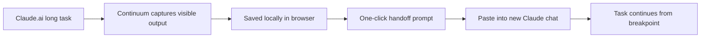

# Continuum 设计方向说明

> 目的：为 Chrome Web Store 图片素材、后续 demo 界面、产品官网和扩展 UI 提供统一设计基准。  
> 当前阶段：v0.1 MVP，重点是让用户理解“Claude 长任务中断后可以接着做”，并建立本地、可信、不打扰的产品感。

## 0. 一句话设计原则

Continuum 的界面应该像一个安静可靠的工作保护层：平时不打扰，出事时能立刻告诉用户“你的任务还在，这里可以继续”。



这张图是后续 demo、商店截图和宣传图块的核心叙事：不是“另一个聊天工具”，而是“Claude 长任务的本地接力层”。

## 1. 整体设计关键词

| 关键词 | 设计含义 | 落地方式 |
|---|---|---|
| 安静保护 | Continuum 不应该像警报器，而应该像后台安全网 | 低饱和色、克制动效、少弹窗、少红色 |
| 专业工具 | 面向把 Claude 当工作台的写作者、开发者、研究者和 AI 产品用户 | 信息密度适中，强调状态、记录、接力动作 |
| AI 工作流感 | 产品不是普通剪贴板工具，而是 AI 长任务恢复层 | 使用“任务流”“断点”“handoff”“继续”的视觉隐喻 |
| 本地可信 | 核心卖点是不上云、不注册、不上传对话内容 | 明确展示 Local-first、IndexedDB、本地保存等信任信息 |
| 断点续航 | 用户最关心的是“前面不要白干” | 所有主视觉都围绕“停下的地方继续走”展开 |

## 2. 视觉风格

### 推荐风格

Continuum 应采用“简洁、专业、偏工具型、带一点 AI 产品感”的风格。

它不适合做成强营销、强装饰、炫彩 AI 生成图风格。原因是用户使用它的场景通常发生在焦虑时刻：Claude 中断、quota 撞墙、长任务接不上。界面越稳定、越可信，越容易让用户相信“我的工作还在”。

### 视觉语言

- 主色：深墨色 / slate，用于标题、主按钮、任务名。
- 辅色：emerald / green，用于“已保护”“本地保存”“可恢复”的正向状态。
- 警示色：amber，用于“可能中断”“需要接力”，避免大面积红色制造恐慌。
- 背景：浅灰白，保持 Chrome 扩展工具的清爽感。
- 圆角：4-8px，小卡片和按钮保持紧凑，不做过度圆润。
- 字体：系统 sans-serif，优先清晰和跨平台一致性。
- 图标：继续使用 lucide 风格线性图标，表达“保护、复制、打开、记录、恢复”。

建议 token：

```text
Background:   #F8FAFC / #F1F5F9
Text primary: #0F172A
Text muted:   #64748B
Primary:      #0F172A
Success:      #10B981
Warning:      #F59E0B
Border:       #E2E8F0
Code bg:      #111827
Radius:       6px or 8px
```

### 不建议

- 不要使用大面积紫蓝渐变，容易变成泛 AI SaaS 风格。
- 不要使用过多发光球、bokeh、抽象科技背景。
- 不要让截图里充满长段说明文字，商店截图要让用户一眼看到功能。
- 不要把它包装成“替 Claude 生成总结”的云服务，它的核心是本地捕获和接力。

## 3. 产品界面结构

### 3.0 总体信息架构

```text
Continuum
├─ Popup
│  ├─ 当前保护状态
│  ├─ 最近任务摘要
│  └─ 入口：任务列表 / 新 Claude Chat
├─ Task List
│  ├─ 本地任务列表
│  ├─ 任务详情
│  ├─ Handoff 预览
│  └─ 操作：复制接力 Prompt / 打开新 Chat
└─ Chrome Web Store Listing
   ├─ 价值主张：Pick up where Claude left off
   ├─ 隐私承诺：Local-first, no cloud
   └─ 核心场景：quota interruption recovery
```

### 3.1 Popup

目标：让用户打开扩展后 3 秒内知道“当前是否被保护、最近任务是什么、下一步点哪里”。

推荐结构：

```text
┌──────────────────────────────┐
│ Continuum                    │
│ Pick up where Claude left off│
├─────────┬─────────┬──────────┤
│ 任务数  │ 保护中  │ 中断      │
├──────────────────────────────┤
│ 当前任务                      │
│ 任务标题 / 最近保存时间       │
├──────────────┬───────────────┤
│ 任务列表      │ 新 Claude Chat │
└──────────────┴───────────────┘
```

设计重点：

- 标题区只讲品牌和一句价值主张。
- 数字区给用户安全感：任务存在、保护正在进行。
- 主操作不超过两个：打开任务列表、打开新 Claude Chat。
- 不要在 popup 放复杂设置，避免工具变重。

### 3.2 Task List / 任务管理页

目标：让用户在中断后快速找到任务，并复制接力 prompt。

推荐结构：

```text
┌──────────────────────────────────────────────┐
│ Continuum                         新 Claude Chat │
├────────────────┬─────────────────────────────┤
│ 任务列表        │ 任务详情                     │
│ - Task A        │ 标题 / 状态 / conversation   │
│ - Task B        │ [复制接力 Prompt] [打开新 Chat]│
│ - Task C        │ [预览 Handoff]               │
│                │ Handoff 预览                 │
└────────────────┴─────────────────────────────┘
```

信息层级：

1. 任务标题和状态。
2. 最后保存时间、捕获方式、录制轮次。
3. 恢复动作：复制、复制并打开、预览。
4. Handoff 内容。

交互重点：

- “复制接力 Prompt”必须是最强主按钮。
- “复制并打开新 Chat”是恢复流程的快捷路径。
- Handoff 预览要可滚动、等宽字体、深色背景，方便用户确认内容。
- 每次复制/打开/预览后要给明确成功或失败反馈。

### 3.3 中断状态

中断不是错误页，而是“可恢复状态”。

状态表达建议：

- 正常保护中：绿色标签，文案“保护中”。
- 已中断：琥珀色标签，文案“可接力”或“已中断”。
- 无任务：空态文案引导“打开 Claude.ai 并发送消息后，这里会出现本地保护记录”。

避免使用“失败”“崩溃”“丢失”等加重焦虑的词。

## 4. Chrome Web Store 图片素材方向

素材优先级：

| 素材 | 尺寸 | 是否必需 | 当前建议 |
|---|---:|---|---|
| 商店图标 | 128x128 | 必需 | 先做，影响上传和品牌识别 |
| 屏幕截图 | 1280x800 或 640x400 | 必需，至少 1 张 | 建议做 3 张 1280x800 |
| 小型宣传图块 | 440x280 | 必需 | 必做，商店卡片曝光核心 |
| 顶部宣传图块 | 1400x560 | 可选但建议 | 建议做，方便后续争取更好展示 |
| 宣传视频 | YouTube URL | 可选 | MVP 阶段先不做 |

导出要求：

- 截图和宣传图块使用 JPEG 或 24-bit PNG，不使用 alpha 透明层。
- 截图画布必须是完整的 1280x800 或 640x400；不要导出带透明边距的图片。
- 截图不要展示真实账号、真实 conversation id、私人 Claude 内容。
- 宣传图块以图形表达为主，文字越少越好，因为商店缩略图会被压缩展示。
- 所有素材避免使用 Claude / Anthropic 官方 logo 或造成官方合作暗示。

### 4.1 商店图标，128x128

设计目标：小尺寸下能被识别为“继续、接力、保护”。

建议方案：

- 图形：一个断点续接符号，可以是两段线在中间接上，也可以是环形箭头包住一个短横线。
- 尺寸：总画布 128x128；主体图形约 96x96，四周保留约 16px 呼吸空间。
- 颜色：深墨底或白底，搭配 emerald 绿色接续线。
- 不要放文字“Continuum”，128px 下不可读。
- 不要用 Claude 官方标志或过度相似的 Anthropic 品牌元素。

图标语义：

```text
断点  ->  接上
中断  ->  继续
本地  ->  保护
```

### 4.2 屏幕截图，1280x800 或 640x400，至少 1 张，最多 5 张

建议做 3 张截图。

截图 1：Popup 保护状态，1280x800

- 画面：Claude 页面右上角打开 Continuum popup。
- 标题文案：`Quietly protects long Claude tasks`
- 重点：展示任务数、保护中、当前任务。
- 中文版标题备选：`默默保护你的 Claude 长任务`

截图 2：任务列表与 Handoff 预览，1280x800

- 画面：任务管理页，左侧任务列表，右侧 handoff 预览。
- 标题文案：`Generate a handoff prompt with one click`
- 重点：展示“复制接力 Prompt”“复制并打开新 Chat”按钮。
- 中文版标题备选：`一键生成接力 Prompt`

截图 3：本地隐私与恢复流程，1280x800

- 画面：用轻量标注展示 `Claude.ai -> Local IndexedDB -> Handoff -> New Chat`。
- 标题文案：`Local-first. No cloud. No extra Claude tokens.`
- 重点：强调不上云、不注册、不上传。
- 中文版标题备选：`本地保存，不上传对话内容`

截图构图建议：

- 使用真实 UI 截图，也可以在同一张 1280x800 画布内加入标题和功能标注，但整张图必须填满画布。
- 不要让核心 UI 贴边，主体内容区保留 48-72px 安全边距。
- 不要用小字号长段落，商店缩略图里看不清。
- 不要展示真实用户账号、conversation id、私人对话内容。

### 4.3 小型宣传图块，440x280

目标：在 Chrome Web Store 卡片中快速解释产品。

建议布局：

```text
┌────────────────────────┐
│ Continuum              │
│ Pick up where Claude   │
│ left off.              │
│                        │
│ [Claude stream] ->     │
│ [Local handoff prompt] │
└────────────────────────┘
```

视觉建议：

- 左上角品牌名，下面一句 tagline；文字尽量少，图形流程是主体。
- 右侧或下方放抽象 UI 卡片：Claude 输出流、接力 prompt、绿色连接线。
- 保持 440x280 下的文字可读，不超过 8-10 个英文词或 12-16 个中文字。
- 推荐英文主文案：`Pick up where Claude left off.`
- 推荐中文主文案：`从 Claude 停下的地方继续。`

### 4.4 顶部宣传图块，1400x560

目标：作为更完整的品牌横幅，表达“长任务被截断也能继续”。

建议布局：

```text
┌──────────────────────────────────────────────┐
│ Continuum                                    │
│ Pick up where Claude left off.               │
│                                              │
│ Claude task stream  ->  Saved locally  ->    │
│ Handoff prompt      ->  New chat continues   │
└──────────────────────────────────────────────┘
```

视觉建议：

- 左侧：品牌、tagline、简短价值说明。
- 右侧：四步流程图，不需要真实复杂 UI。
- 主色仍然是 slate + emerald。
- 不能出现 “Claude 官方合作” 暗示，避免商标风险。
- 适合放英文文案，因为顶部宣传图块是全球通用资源；中文商店页可以依靠截图标题补足中文说明。

## 5. 组件与交互建议

### 5.0 组件优先级

MVP 阶段只需要把“状态、列表、预览、复制”四件事做清楚：

| 组件 | 用途 | 设计要求 |
|---|---|---|
| Status badge | 表示保护中、可接力、已完成 | 颜色明确，文案短 |
| Task row | 显示本地任务 | 标题、时间、状态必须可扫视 |
| Handoff preview | 让用户确认要复制的内容 | 等宽字体、固定高度滚动 |
| Copy button | 核心恢复动作 | 页面上最醒目的主按钮 |
| Empty state | 没有记录时引导下一步 | 告诉用户去 Claude.ai 发送消息 |

### 5.1 按钮

- 主按钮：深色实心，动词明确，例如“复制接力 Prompt”。
- 次按钮：白底描边，例如“预览 Handoff”“打开新 Chat”。
- 禁用态：降低透明度，同时保留布局宽度，避免按钮跳动。

### 5.2 状态标签

- 保护中：绿色。
- 可接力 / 已中断：琥珀色。
- 已完成：中性灰。
- 错误：仅在真实失败时使用红色。

### 5.3 Handoff 预览

- 使用等宽字体。
- 深色背景配浅色文本，类似开发者工具的 code preview。
- 保留复制按钮在预览上方，不要让用户滚到底部才能操作。
- 长文本默认折叠或固定高度滚动，避免页面过长。

### 5.4 空态

空态不要只写“暂无数据”，要解释下一步：

```text
打开 Claude.ai 并发送消息后，这里会出现本地保护记录。
```

### 5.5 反馈

每个关键动作都要有反馈：

- 复制成功：`接力 Prompt 已复制。`
- 打开新 Chat：`已打开新的 Claude Chat，请粘贴接力 Prompt。`
- 无记录：`还没有可生成 handoff 的可见输出。`

## 6. 可参考工具与借鉴点

参考这些工具不是为了照抄视觉，而是为了借鉴它们如何让复杂工作流看起来简单、可靠、可控。

### Raycast

参考链接：https://www.raycast.com/

可借鉴：

- 高效、命令式、低噪音的工具气质。
- 功能入口清晰，强调“快速完成动作”。
- 对开发者和高频工具用户友好。

不适合直接照搬：

- Raycast 是全局命令中心，Continuum 是浏览器扩展，不应做复杂命令面板。
- Continuum 的首要目标不是搜索，而是任务保护和恢复。

### Notion Web Clipper

参考链接：https://www.notion.com/en-US/web-clipper

可借鉴：

- “后台保存当前内容”的轻量扩展心智。
- 操作链路短：打开扩展、确认内容、保存。
- 商店截图可以直接展示浏览器扩展在页面中的使用方式。

不适合直接照搬：

- Notion Web Clipper 偏资料收集，Continuum 偏 AI 任务恢复。
- Continuum 不应该强调云同步或知识库归档，而应强调本地和接力。

### Todoist

参考链接：https://todoist.com/

可借鉴：

- 任务列表的清晰层级：标题、状态、时间、行动按钮。
- 适合高频工作场景的克制视觉。
- 用清楚的状态和优先级帮助用户快速扫视。

不适合直接照搬：

- Continuum 不是任务管理器，不应引入项目、标签、截止日期等复杂概念。
- 当前 MVP 只需要“Claude conversation -> local task -> handoff”。

### Grammarly

参考链接：https://www.grammarly.com/

可借鉴：

- 浏览器内安静存在，需要时出现。
- 辅助工作流而不抢走主应用注意力。
- 用小而明确的状态反馈建立信任。

不适合直接照搬：

- Grammarly 是实时写作建议，Continuum 不应在 Claude 输入框里大量打扰用户。
- 当前阶段不做强实时评分或浮层干预。

## 7. 商店素材生产清单

建议按这个顺序产出：

```text
assets/store/
├─ icon-128.png
├─ screenshot-1-popup-protection.png
├─ screenshot-2-task-handoff.png
├─ screenshot-3-local-first.png
├─ promo-small-440x280.png
└─ promo-marquee-1400x560.png
```

每张图的验收标准：

| 文件 | 验收标准 |
|---|---|
| icon-128.png | 128x128，主体在小尺寸下清楚，不含文字，不像官方 Claude 图标 |
| screenshot-1 | 能看出浏览器扩展正在保护 Claude 任务 |
| screenshot-2 | 能看出“一键复制接力 Prompt”是核心动作 |
| screenshot-3 | 能看出本地保存、无云端上传、恢复到新 chat |
| promo-small | 缩小到 220x140 仍能读出 Continuum 和核心价值 |
| promo-marquee | 适合横幅展示，留足边距，品牌和流程都清楚 |

## 8. 后续设计落地顺序

1. 先完成商店图标、3 张截图、小型宣传图块。
2. 再优化 popup 的品牌感和文案层级。
3. 再优化任务管理页的信息密度和 handoff 预览。
4. 最后做顶部宣传图块和官网/README 视觉统一。

## 9. 设计验收标准

- 用户 5 秒内能理解：Continuum 是 Claude 长任务中断后的接力工具。
- 商店截图不暴露私人账号、真实对话或 conversation id。
- popup 中主操作不超过两个。
- task-list 中“复制接力 Prompt”是最清楚的主路径。
- 所有文案都避免暗示 Continuum 是 Claude 官方产品。
- 所有隐私相关表达都一致：本地保存、不上传、不读取隐藏 reasoning。

## 10. 参考来源

- Chrome Web Store 图片规范：https://developer.chrome.com/docs/webstore/images
- Raycast：https://www.raycast.com/
- Notion Web Clipper：https://www.notion.com/web-clipper
- Todoist：https://todoist.com/
- Grammarly：https://www.grammarly.com/
